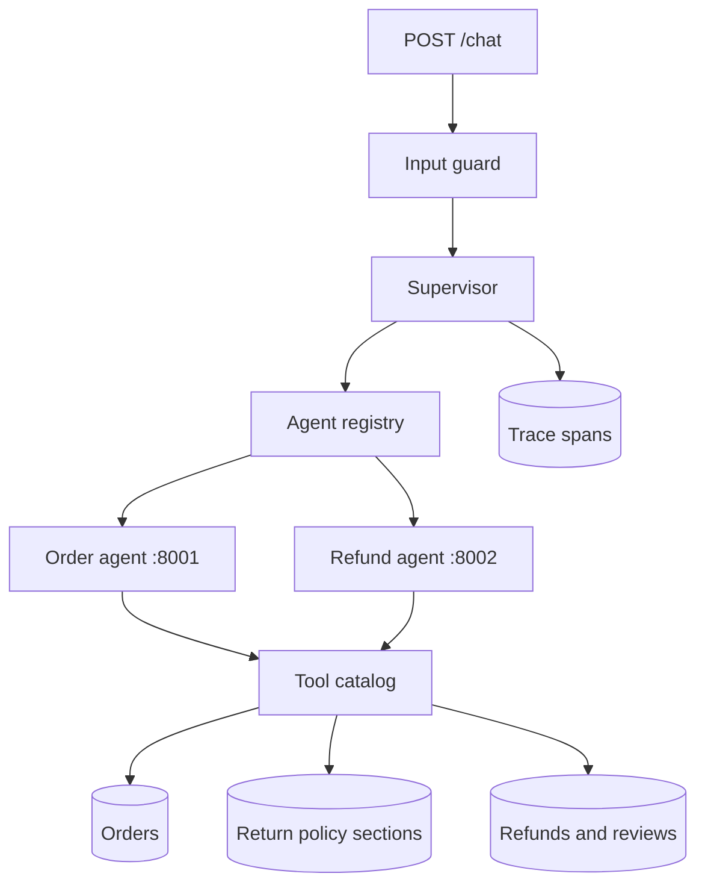

# pluggable-support-agents

A customer-support backend with three processes. A supervisor receives the chat message, discovers a specialist, and delegates over HTTP. The Order agent listens on port 8001 and the Refund agent on port 8002. Stopping one specialist leaves the chat page and the other specialist running. Tools are the only code that reads or writes orders, the return policy, refunds, and refund reviews.

The default model is deterministic, so the service runs locally with no API key. Set `MODEL_PROVIDER=openai` and point `MODEL_BASE_URL` at any OpenAI-compatible chat completions endpoint when you want a live model. The same agents, registry, and tools stay in place. Saved preferences and earlier turns in the session are sent with the next message, so a follow-up such as "refund that laptop" can resolve the order.

## Request path



`POST /chat` loads the customer, then the supervisor runs:

1. A card number or a prompt-injection phrase is refused before any agent runs. Email addresses and card numbers are masked in stored messages and in tool results.
2. A preference such as "I prefer email" is saved and does not start a workflow.
3. An order or refund request searches the registry and delegates to the specialist URL.
4. The specialist calls a tool. A policy question returns the matching section, not the whole file.
5. The reply, the agents involved, and each step's duration come back with a trace id. `GET /traces/{trace_id}` returns the same waterfall.

## Refund rules

| Tier | Window | Refund |
|---|---|---|
| Gold | 30 days from delivery | 100% of the purchase price |
| Silver | 20 days from delivery | 75% of the purchase price |
| Bronze | 15 days from delivery | Pending review, no automatic refund |

Eligible statuses are `delivered`, `shipped`, and `return_requested`. A damage or defect claim without a description is saved until the customer describes what broke. With that note, gold and silver refunds continue, and bronze still goes to review. `process_refund` checks the rule again, so a refund cannot be written by skipping eligibility. A bronze order inside the window is saved as a pending review. The customer can ask about that review later. Riley can approve it for a specific amount or reject it. A customer cannot decide their own review.

## Run

```bash
python3 -m venv .venv
source .venv/bin/activate
pip install -e ".[dev]"
pytest
uvicorn app.order_service:app --host 127.0.0.1 --port 8001
uvicorn app.refund_service:app --host 127.0.0.1 --port 8002
uvicorn app.main:app --host 127.0.0.1 --port 8000
```

Run each `uvicorn` command in its own terminal. Open [http://127.0.0.1:8000](http://127.0.0.1:8000) and log in. The chat page shows which agent ran each tool and how long that step took. `POST /chat` reads the customer from the login cookie, not from the request body.

To run one live-model conversation through an order lookup, a policy excerpt, the input guard, and a reviewer approving Sam's pending refund:

```bash
MODEL_API_KEY=... python scripts/live_conversation.py
```

| Username | Password | Tier | Sample order |
|---|---|---|---|
| `avery` | `gold-pass` | gold | `ORD-10001` laptop, delivered 10 days ago |
| `jordan` | `silver-pass` | silver | `ORD-20001` headphones, delivered 8 days ago |
| `sam` | `bronze-pass` | bronze | `ORD-30001` mug, delivered 3 days ago, held for review |
| `riley` | `review-pass` | reviewer | Decides pending reviews |

```bash
curl -s -c /tmp/support.cookies localhost:8000/login \
  -H 'content-type: application/json' \
  -d '{"username":"avery","password":"gold-pass"}'

curl -s -b /tmp/support.cookies localhost:8000/chat \
  -H 'content-type: application/json' \
  -d '{"message":"What is the status of ORD-10001?"}'
```

Postgres instead of SQLite:

```bash
docker compose up --build
```

## Configuration

Copy `.env.example` to `.env`.

| Variable | Purpose |
|---|---|
| `DATABASE_URL` | SQLAlchemy URL. Defaults to SQLite. |
| `MODEL_PROVIDER` | `deterministic` or `openai` |
| `MODEL_BASE_URL` | OpenAI-compatible chat completions endpoint |
| `MODEL_NAME` | Model name sent to that endpoint |
| `MODEL_API_KEY` | Bearer token for the live model |
| `ORDER_AGENT_URL` | Address the supervisor uses for the Order agent. Defaults to `http://127.0.0.1:8001`. |
| `REFUND_AGENT_URL` | Address the supervisor uses for the Refund agent. Defaults to `http://127.0.0.1:8002`. |
| `AGENT_TRANSPORT` | `http` calls the specialist URLs. Tests use `asgi` so they do not bind ports. |
