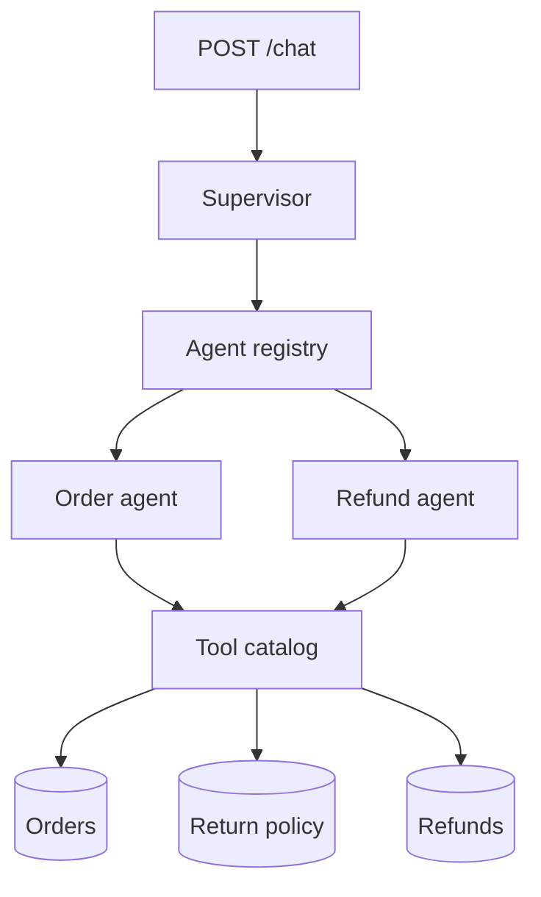

# pluggable-support-agents

A customer-support backend with three agents. A supervisor receives the chat message, discovers a specialist, and delegates. The Order agent and Refund agent are the only callers of tools. Tools are the only code that reads or writes orders, the return policy, and refunds.

The default model is deterministic, so the service runs locally with no API key. Set `MODEL_PROVIDER=openai` and point `MODEL_BASE_URL` at any OpenAI-compatible endpoint when you want a live model. The tools, registry, and request path stay the same.

## Request path



`POST /chat` loads the customer, then the supervisor runs:

1. A preference such as "I prefer email" is saved and does not start a workflow.
2. An order or refund request searches the registry and delegates to the matching specialist.
3. The specialist calls a tool. Email and shipping address are masked before the result returns to the agent.
4. The reply, the agents involved, and the tool steps come back with a trace id.

## Refund rules

| Tier | Window | Refund |
|---|---|---|
| Gold | 30 days from delivery | 100% of the purchase price |
| Silver | 20 days from delivery | 75% of the purchase price |
| Bronze | 15 days from delivery | Held for condition review |

Eligible statuses are `delivered`, `shipped`, and `return_requested`. A damage or defect claim needs a damage note. `process_refund` checks the rule again, so a refund cannot be written by skipping eligibility.

## Run

```bash
python3 -m venv .venv
source .venv/bin/activate
pip install -e ".[dev]"
pytest
uvicorn app.main:app --reload
```

SQLite is created at `support.db` on startup and loaded with three customers:

| Customer | Tier | Sample order |
|---|---|---|
| `CUST-789` | gold | `ORD-10001` laptop, delivered 10 days ago |
| `CUST-456` | silver | `ORD-20001` headphones, delivered 8 days ago |
| `CUST-123` | bronze | `ORD-30001` mug, delivered 3 days ago |

```bash
curl -s localhost:8000/chat \
  -H 'content-type: application/json' \
  -d '{"customer_id":"CUST-789","message":"What is the status of ORD-10001?"}'
```

```bash
curl -s localhost:8000/chat \
  -H 'content-type: application/json' \
  -d '{"customer_id":"CUST-789","message":"Refund order ORD-10001"}'
```

Postgres instead of SQLite:

```bash
docker compose up --build
```

## Configuration

Copy `.env.example` to `.env`.

| Variable | Purpose |
|---|---|
| `DATABASE_URL` | SQLAlchemy URL. Defaults to SQLite. |
| `MODEL_PROVIDER` | `deterministic` or `openai` |
| `MODEL_BASE_URL` | OpenAI-compatible chat completions endpoint |
| `MODEL_NAME` | Model name sent to that endpoint |
| `MODEL_API_KEY` | Bearer token for the live model |
